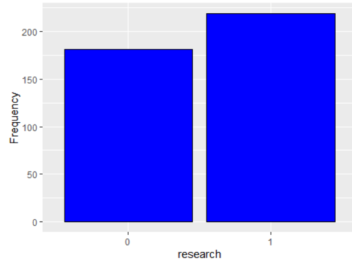
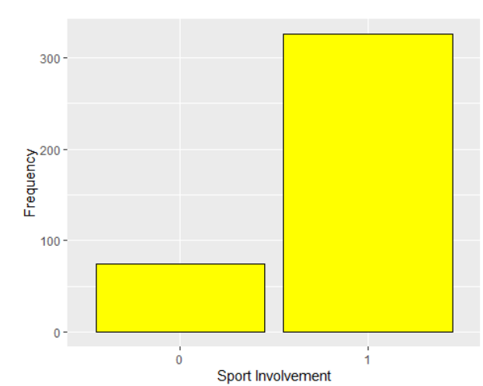
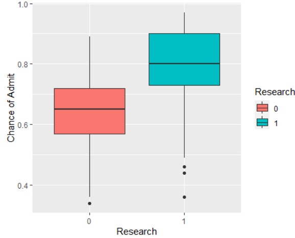
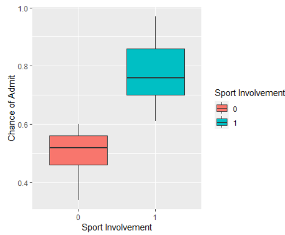
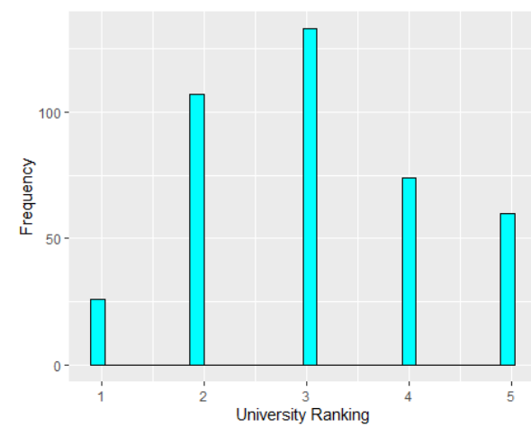
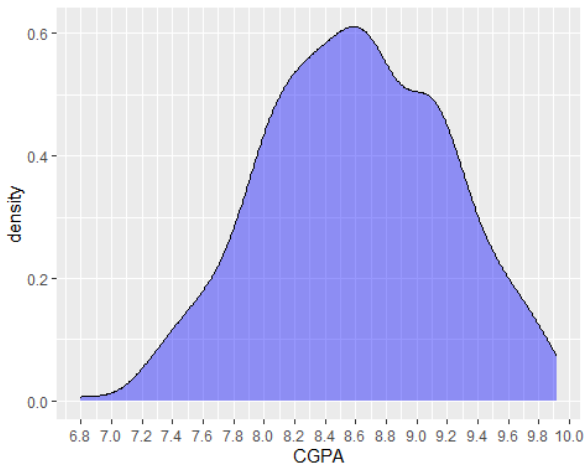
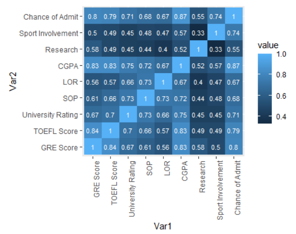

# phase1
This phase analyzes factors influencing graduate school admission chances using a dataset containing academic and extracurricular metrics. The goal is to build a predictive model for admission probability based on applicant profiles.

# Dataset
The dataset contains 400 observations with the following features:

:one: GRE Score (out of 340)

:two: TOEFL Score (out of 120)

:three: University Rating (out of 5)

:four: Statement of Purpose (SOP) Strength (out of 5)

:five: Letter of Recommendation (LOR) Strength (out of 5)

:six: Undergraduate GPA (CGPA) (out of 10)

:seven: Research Experience (binary: 0 or 1)

:eight: Sport Involvement (binary: 0 or 1)

:nine: Chance of Admit (target variable, range 0-1)

# :key: Key Steps and Findings

## \:mag: Data Preprocessing and Cleaning
:heavy_check_mark: No missing values or duplicates were found.

:heavy_check_mark: Verified that all values were within expected ranges and logically consistent — no sentinel or unexpected values were found.

:heavy_check_mark: Converted categorical variables (Research, Sport Involvement) to factors.

*Data was logical and clean*

## :bar_chart: Exploratory Data Analysis

:female_detective: Research Engagement: Nearly equal distribution between students with and without research experience.

:cartwheeling: Sport Involvement: Majority of students participated in sports.

:signal_strength: Involvement in sports or research activities is associated with a higher likelihood of admission.

  
  

:3rd_place_medal: University Ratings: Most applications were to universities rated 3.

:capital_abcd: CGPA Distribution: Highest density of applicants had CGPAs between 8.5 and 8.7.

:infinity: Correlation Analysis: All predictors showed significant correlation with the target variable (Chance of Admit).

\:chart\_with\_upwards\_trend: Linear Model Development

Initial Models: Simple linear regression confirmed significant relationships between each predictor and admission chance.

Final Model:
Chance of Admit ~ Sport Involvement + GRE Score * TOEFL Score + LOR + Research * CGPA

Performance:
R²: 0.904 (after outlier removal)
RSE: 0.044

Outlier Handling: Identified and removed 4 outliers, improving model performance (R² increased from 0.894 to 0.904).
