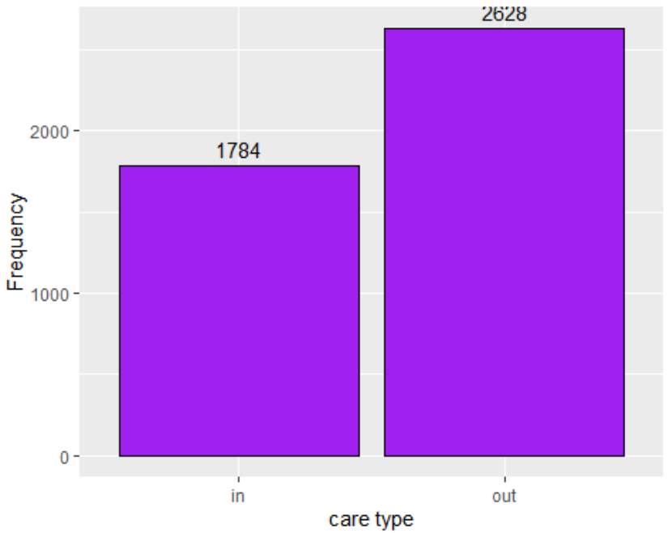
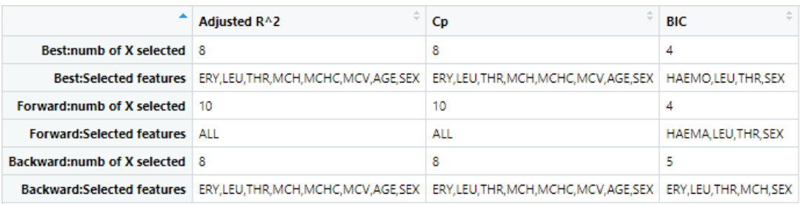
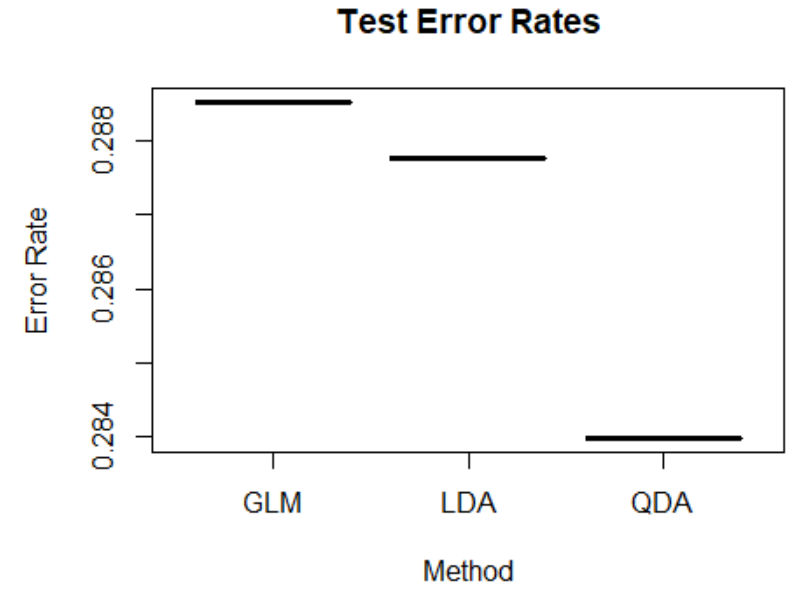

# phase2
This phase utilizes Electronic Health Records (EHRs) from a private hospital in Indonesia to build a classification model that predicts whether a patient should be categorized as “in care” or “out care.”

# Dataset 
The dataset contains 4412 observations with the following features:

:one: HAEMATOCRIT (HAEMA)

:two: HAEMOGLOBINS (HAEMO)

:three: ERYTHROCYTE (ERY)

:four: LEUCOCYTE (LEU)

:five: THROMBOCYTE (THR)

:six: MCH

:seven: MCHC

:eight: MCV

:nine: AGE

:keycap_ten: SEX	

:one::one: SOURCE

# :key: Key Steps and Findings

## \:mag: Data Preprocessing and Cleaning
:heavy_check_mark: No missing values or duplicates were found.

:heavy_check_mark: Converted character variables `SEX` and `SOURCE` to factors.

:heavy_check_mark: Class distribution was balanced: ~40.4% in care, ~59.6% out care.

*Data was logical and clean*

## :scissors: Subset Selection: was performed using:

:arrow_right: Best Subset

:arrow_right: Forward Selection

:arrow_right: Backward Elimination

Evaluation Metrics:

:arrow_right: Adjusted R²

:arrow_right: Mallows’ Cp

:arrow_right: BIC

### An overall summary :
The same features were selected by Cp and Adjusted R² in both the best and backward subset selection methods. However, the forward subset selection method chose the full features.
Meanwhile, BIC selected a four-variable model in both the best and forward selection approaches, differing by one predictor: HAEMOGLOBINS in the best subset and HAEMATOCRIT in the forward subset.
Finally, BIC selected a five variables in the backward selection method.
Since BIC applies a heavier penalty on model complexity—especially when n > 7—it is not unusual for it to favor models with fewer predictors.

:date: The table below summarizes how many features were selected by each metric (lowest score for Cp and BIC, and highest score for Adjusted R²), along with the names of the selected features.

Based on the features selected through best, forward, and backward subset selection—using Adjusted R², Cp, and BIC as evaluation criteria—our objective is to identify the most suitable model for our dataset. We will begin by fitting each of these models using logistic regression, followed by Linear Discriminant Analysis (LDA) and Quadratic Discriminant Analysis (QDA).
Model performance will be evaluated using k-fold cross-validation to ensure robust and reliable accuracy assessments.

## 📈 Classification Techniques and 🔁 Resampling Techniques
Across the :three: classification techniques, the model including `HAEMOGLOBINS`, `LEUCOCYTE`, `THROMBOCYTE`, and `SEX` appears to be the best fit for our data.

Additionally, Quadratic Discriminant Analysis (QDA) appears to be the best fit for our data when using these four features.

