# phase3

This phase builds upon the previous work by applying advanced clustering techniques (K-means and Hierarchical Clustering) and classification methods (Decision Trees, Bagging, Random Forest, and Boosting) to predict patient care categories ("in care" or "out care") using Electronic Health Records (EHRs) from a private hospital in Indonesia.

# Dataset (Reminder)
The dataset contains 4412 observations with the following features:

1️⃣ HAEMATOCRIT (HAEMA)

2️⃣ HAEMOGLOBINS (HAEMO)

3️⃣ ERYTHROCYTE (ERY)

4️⃣ LEUCOCYTE (LEU)

5️⃣ THROMBOCYTE (THR)

6️⃣ MCH

7️⃣ MCHC

8️⃣ MCV

9️⃣ AGE

🔟 SEX

1️⃣1️⃣ SOURCE

## 🔑 Key Steps and Findings  

### 🔍 Data Preprocessing and Cleaning  
- **Outlier Removal**: Outliers were identified and removed using boxplots for each numerical feature. The dataset was reduced from 4412 to 3694 observations (718 outliers removed).  
- **Standardization**: Data was standardized to ensure compatibility with PCA and clustering algorithms.  

### 🌳 Classification Techniques  
#### Decision Tree  
- **Accuracy**: 74.37%  
- **Key Splits**: THROMBOCYTE, ERYTHROCYTE, and LEUCOCYTE were the most important predictors.  

#### Bagging (Random Forest with m = p)  
- **Accuracy**: 76.62%  
- **OOB Error**: 24.21%  

#### Random Forest (m = √p)  
- **Accuracy**: 75.81%  
- **OOB Error**: 24.48%  

#### Boosting (XGBoost)  
- **Accuracy**: 77.44% (highest among all methods)  
- **Key Parameters**: 50 trees, max depth = 3.

📅 The table below shows each tree-based technique and the ranking of its most important variables.

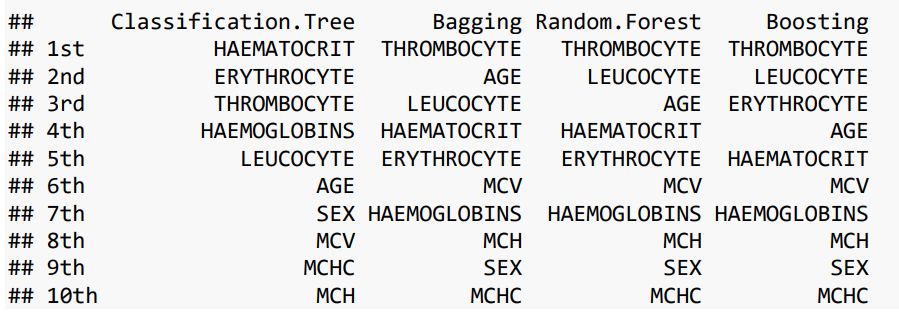

### 🎯 Clustering Techniques  
#### K-means Clustering  
- **Optimal Clusters**: The elbow method suggested **k=3** as the optimal number of clusters.

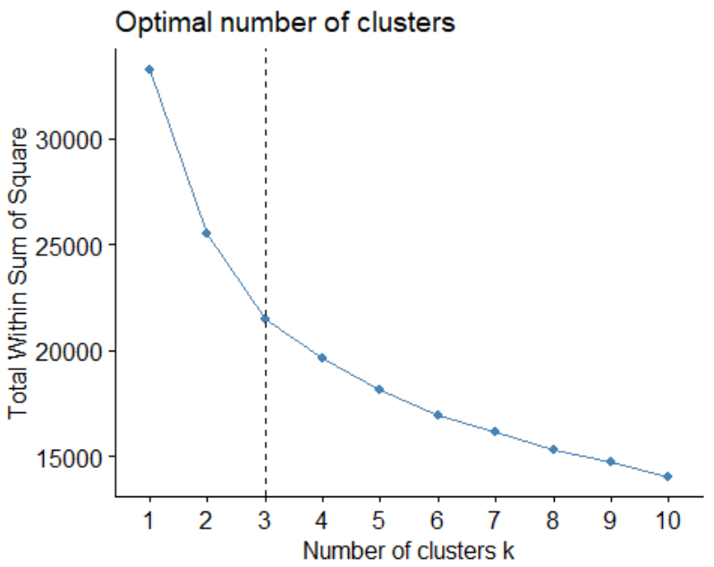
   
- **Patient Distribution**: Out-care patients dominated Clusters 1 and 3, while in-care patients were slightly more prevalent in Cluster 2.
  
 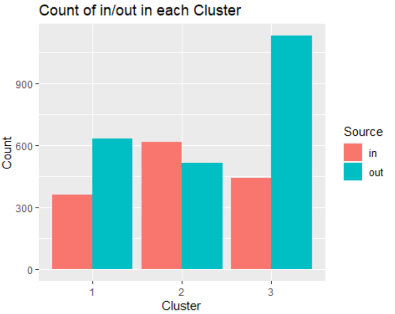

#### Hierarchical Clustering  
- **Linkage Methods**: Compared single, average, and complete linkage. Complete linkage produced the most balanced dendrogram.

  

  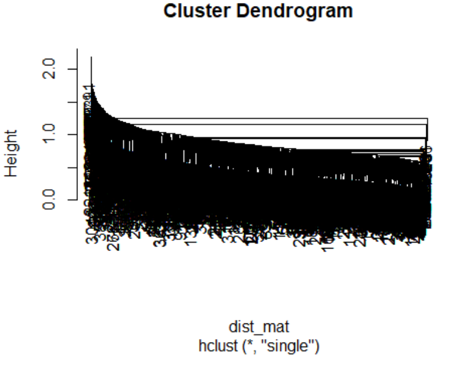
  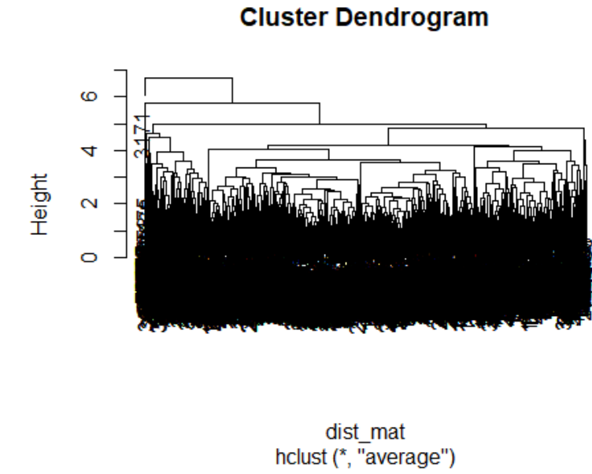
  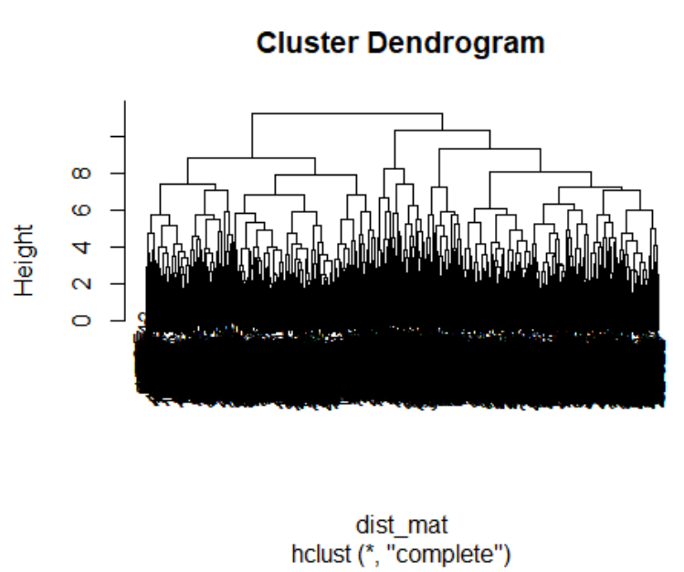

- **Optimal Cut**: The dendrogram was cut into **2 clusters** at height=10.8.

  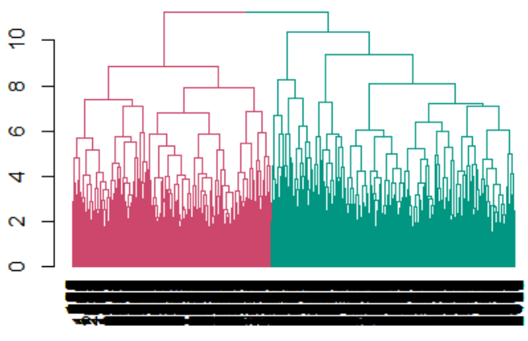

- **Patient Distribution**: Out-care patients outnumbered in-care patients in both clusters, indicating limited separation by care type.  

 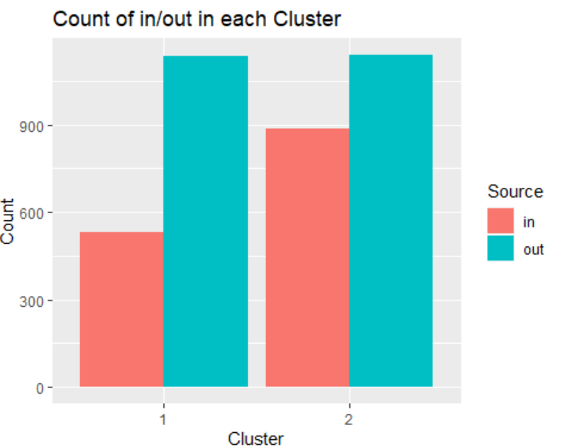

:warning: Neither K-means nor hierarchical clustering effectively separated in-care and out-care patients, suggesting these methods may not be ideal for this task.  

### 📊 Principal Component Analysis (PCA)  
- **Variance Explained**: The first two principal components explained ~88% of the total variance.
- 
  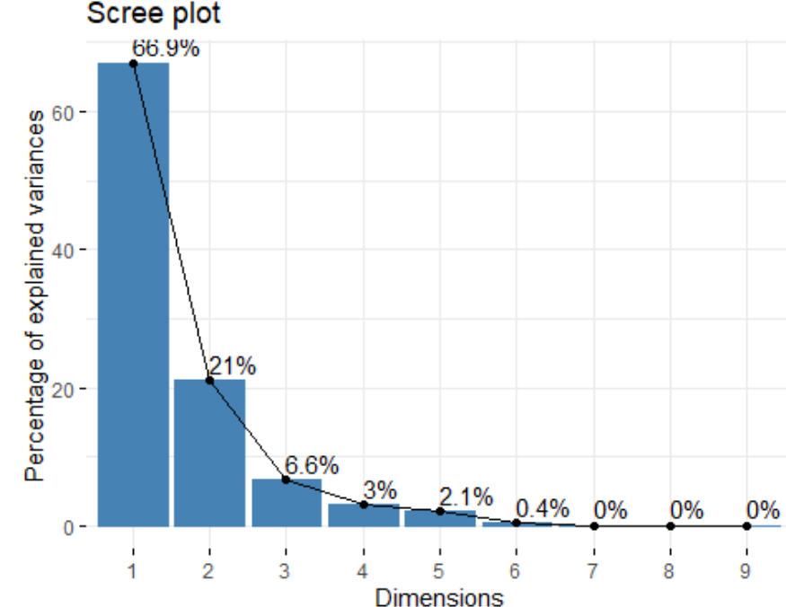
  
- **Key Correlations**:  
  - "ERYTHROCYTE," "HAEMOGLOBINS," and "HAEMATOCRIT" were closely correlated.  
  - "MCV" and "MCH" also showed a directional trend.

    

  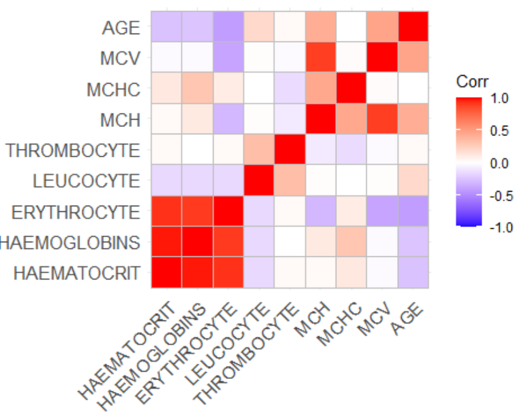
  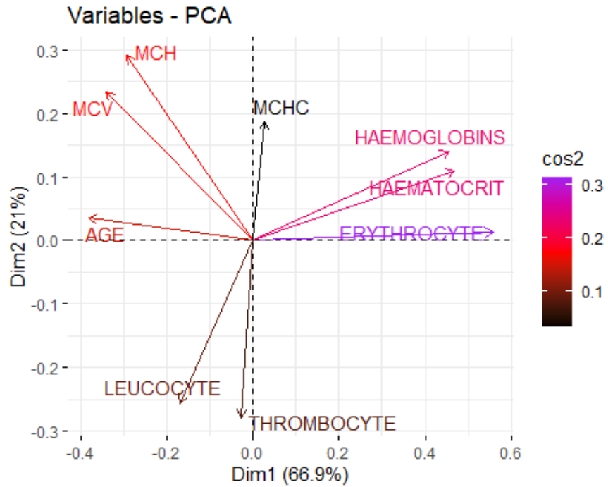

- **Biplot Visualization**: Highlighted the contribution of each variable to the principal components.  

  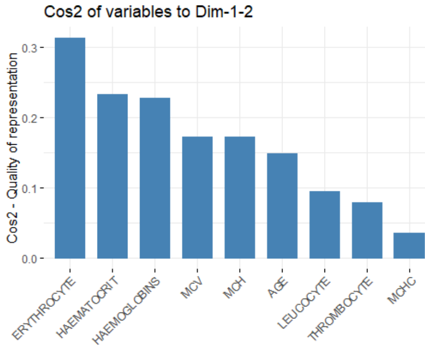 
